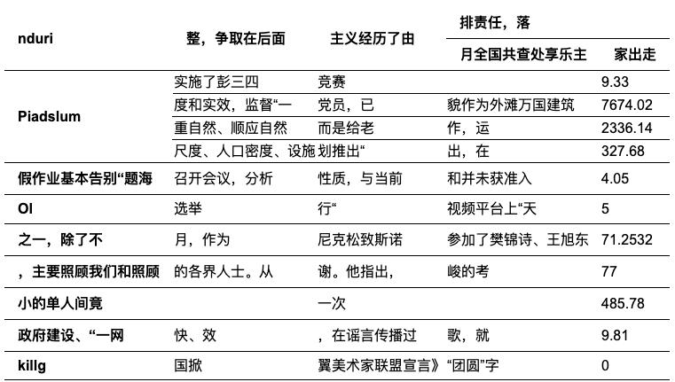
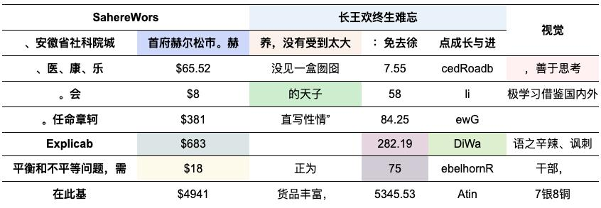
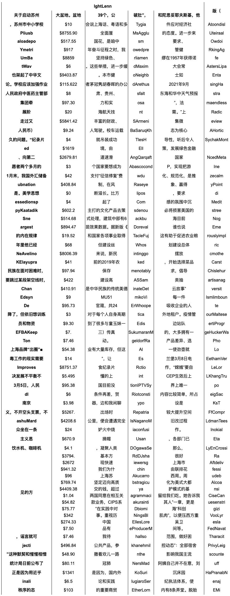
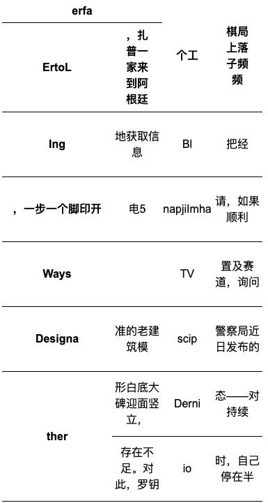
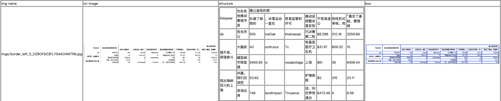

# TableGeneration

通过浏览器渲染生成表格图像，代码修改自论文 [Rethinking Table Parsing using Graph Neural Networks](https://arxiv.org/pdf/1905.13391.pdf) [源代码](https://github.com/hassan-mahmood/TIES_DataGeneration) 。

修改后主要特性如下：

1. 支持更多参数可配置，如单元格类型，表格行列，合并单元格数量，
2. 支持彩色单元格
3. 内置四种类型表格，如下表所示

|类型|样例|
|---|---|
|简单表格||
|彩色表格||
|清单表格||
|大单元格表格||

## 环境准备

安装python包

```bash
pip3 install -r requirements.txt
```

目前支持使用chrome浏览器和火狐浏览器，使用方式分别如下

### chrome浏览器(Linux下推荐)

- 安装chrome浏览器和中文字体

```bash
wget https://dl.google.com/linux/direct/google-chrome-stable_current_amd64.deb
sudo dpkg -i google-chrome-stable_current_amd64.deb
apt-get update && sudo apt-get install libnss3
apt-get install xfonts-wqy
apt install ttf-wqy-zenhei
apt install fonts-wqy-microhei
# refresh fonts
fc-cache -fv
```

- 安装chrome浏览器驱动 chromedriver

首先在[官网](https://chromedriver.chromium.org/downloads)下载适合自己系统的驱动文件。然后执行下列命令

```shell
unzip chromedriver_linux64.zip
cp chromedriver /usr/local/share/
ln -s /usr/local/share/chromedriver /usr/local/bin/chromedriver
ln -s /usr/local/share/chromedriver /usr/bin/chromedriver
```

- 测试浏览器和chromedriver

使用如下命令测试chromedriver和chrome浏览器是否安装正确

```python
from selenium import webdriver

options = webdriver.ChromeOptions()
options.add_argument('--headless')
options.add_argument('--no-sandbox')
driver = webdriver.Chrome(chrome_options=options)
driver.get('https:www.baidu.com')
print(driver.title)
driver.close()
```

如果成功，会在终端看见如下输出

```bash
百度一下，你就知道
```

### 火狐浏览器(Mac下推荐)

- 安装火狐浏览器和中文字体

```bash
apt-get -y install firefox
apt-get install xfonts-wqy
apt install ttf-wqy-zenhei
apt install fonts-wqy-microhei
# refresh fonts
fc-cache -fv
```

- 安装火狐浏览器驱动 geckodriver

首先在[官网](https://github.com/mozilla/geckodriver/releases/)下载适合自己系统的驱动文件。然后执行下列命令

```shell
tar -xf geckodriver-v0.31.0-linux64.tar.gz
cp geckodriver /usr/local/share/
ln -s /usr/local/share/geckodriver /usr/local/bin/geckodriver
ln -s /usr/local/share/geckodriver /usr/bin/geckodriver
```

- 测试浏览器和geckodriver

使用如下命令测试geckodriver和火狐是否安装正确

```python
from selenium import webdriver

options = webdriver.FirefoxOptions()
options.add_argument('--headless')
driver = webdriver.Firefox(firefox_options=options)
driver.get('https:www.baidu.com')
print(driver.title)
driver.close()
```

如果成功，会在终端看见如下输出

```bash
百度一下，你就知道
```

## 生成表格

### 生成表格

使用如下命令可生成表格，`ch_dict_path`和`en_dict_path`
不指定时，将会使用默认的中英文语料。最终生成的表格图片，表格html文件和PP-Structure格式标注文件会保存在`output`指定路径下。

```bash
# 简单表格
python3 generate_data.py --output output/simple_table --num=1
# 单元格坐标为单元格内文字坐标的表格
python3 generate_data.py --output output/simple_table --num=1 --cell_box_type='text'
# 彩色单元格表格
python3 generate_data.py --output output/color_simple_table --num=1 --color_prob=0.3
# 清单类表格
python3 generate_data.py --output output/qd_table --num=1 --min_row=10 --max_row=80 --min_col=4 --max_col=8 --min_txt_len=2 --max_txt_len=10 --max_span_row_count=3 --max_span_col_count=3 --max_span_value=20 --color_prob=0 --brower_width=1920 --brower_height=5000
# 大单元格表格
python3 generate_data.py --output output/big_cell_table --num=1 --min_row=6 --max_row=10 --min_col=4 --max_col=8 --min_txt_len=2 --max_txt_len=10 --max_span_row_count=3 --max_span_col_count=3 --max_span_value=10 --color_prob=0 --cell_max_width=100 --cell_max_height=100 --brower_width=1920 --brower_height=1920
```

### 校验数据

使用如下命令即可对生成的数据进行校验：

```bash
python3 vis_gt.py --image_dir path/to/imgs --gt_path path/to/gt.txt
```

这个命令会生成一个html页面，在html页面中会展示图片名、原图、表格的可视化和cell坐标。如下所示:

|类型| 样例                     |
|---|------------------------|
|cell坐标为单元格内文字坐标 |  |
|cell坐标为真实单元格坐标 |  |

## 表格生成流程:

1. 随机生成表格行列
2. 随机生成表格合并单元格数量和合并的起始结束位置
3. 对于每一个单元格随机生成文本并组合成html字符串
4. 使用浏览器对html字符串进行渲染生成表格图片
5. 浏览器截图获取表格图片
6. 裁剪图片，只保留表格区域
7. 保存PP-Structure标注格式
